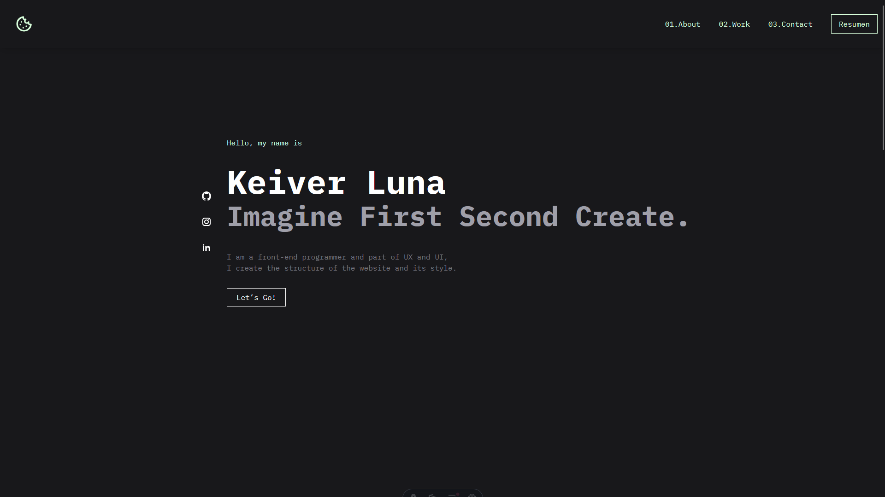

# 🌟 My Astro Project

This is my web portfolio built with **[Astro](https://astro.build/)** and **[Tailwind](https://tailwindcss.com/)** — a modern framework for building fast and optimized websites.

****

## 🚀 Technologies Used

- [Astro](https://astro.build/)
- HTML / CSS / JavaScript
- (Optional: React is already installed. You can also integrate Vue, Svelte, etc.)
- Markdown / MDX (if used)

---

## 📦 Requirements

Make sure you have installed

- [Node.js](https://nodejs.org/) v18 or higher
- [npm](https://www.npmjs.com/) or [pnpm](https://pnpm.io/)

---

## 📁 Project Structure

```text
/
├── public/           # Static assets
├── src/       
│   ├── components/   # Reusable UI components
│   ├── layouts/      # Layouts
│   ├── pages/        # Page routes (auto-routed)
│   └── styles/       # Custom styles
├── astro.config.mjs  # Astro configuration
├── package.json
```

---

## 🛠️ How to Start the Project

1. **Clone the repository**

```bash
git clone https://github.com/Keiver-Dev/Portafolio.git
cd Portafolio
npm run dev
```

2. **🧞 Commands**

All commands are run from the root of the project, from a terminal:

| Command                   | Action                                           |
| :------------------------ | :----------------------------------------------- |
| `npm install`             | Installs dependencies                            |
| `npm run dev`             | Starts local dev server at `localhost:4321`      |
| `npm run build`           | Build your production site to `./dist/`          |
| `npm run preview`         | Preview your build locally, before deploying     |
| `npm run astro ...`       | Run CLI commands like `astro add`, `astro check` |
| `npm run astro -- --help` | Get help using the Astro CLI                     |

